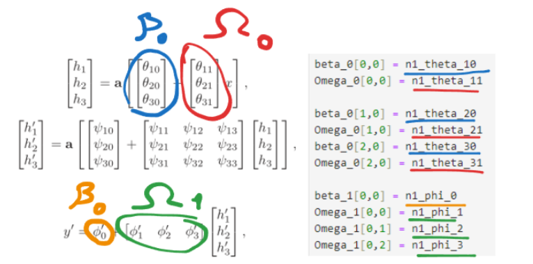
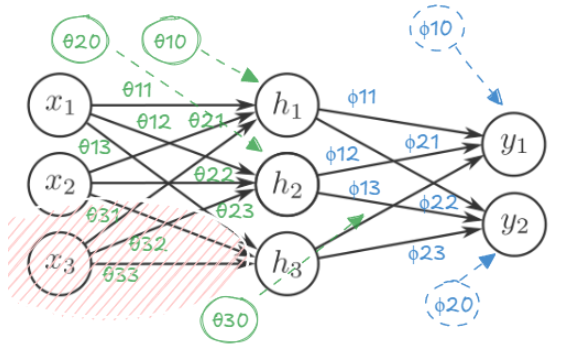

# My solutions for Understanding Deep Learning book by Prince

I'm adding some illustrations to help clarify the numerous new notations introduced in this notebook

## Example illustrations : 

## If you want to join book walkthrough in the group

You can join #fast-bunnies channel @ fastai official [discord](https://discord.gg/qkQx5xan) server

